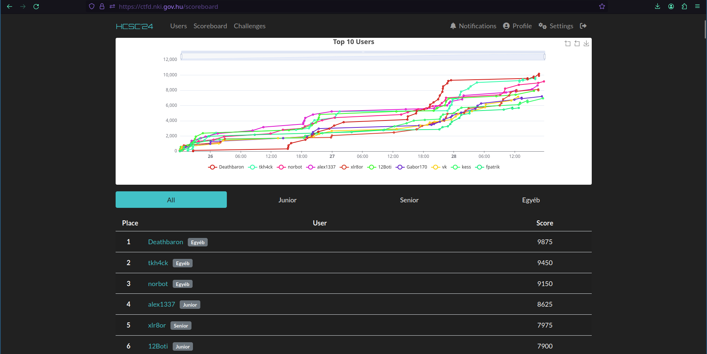

# Hungarian Cyber Security Challenge - 2024

https://nki.gov.hu/rendezvenyek/hcsc/

HCSC is a capture the flag competition organized by the Hungarian government, [National Cyber Security Center Hungary](https://nki.gov.hu/) to be more exact. Most of the challenges were provided by [Óbuda University](https://nik.uni-obuda.hu/). [White Hat IT Security](https://whitehat.eu/) provided the virtual machine forensic challenges.

I've previously participated in the 2023 edition of this competition and got fifth place in the junior category, which was good enough to qualify for the team that participated in the [European Cybersecurity Challenge](https://ecsc.eu/) which is a competition for ctf players in Europe between the age of 16 (14 in some countries) and 25.

This year I decided to step up my game and got first place in the junior (under 20 years old) category and fourth place overall, which is a great result in my opinion. Congratulations to all the players, especially the winners of each category.

The challenges were really great. I liked the VBA stomping technique in the malware challenge, the mobile, elliptic curve crypto, and pwn challenges.

Some statistics:
- 36 challenges in 12 categories
- More than 500 registered players
- 72 hours of hacking time
- 248 competitors submitted at least one flag

The challenges were hosted in a closed network.

**[Service discovery](SERVICES.md)**