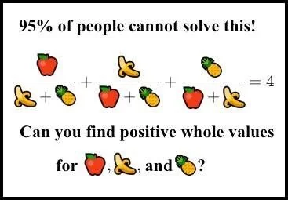

# Writeup
We get the source code of the server in the [challenge.zip](files/challenge.zip) file. After connecting to the server at port `49428/tcp` we get the following prompt.

```
I got a simple challenge for you! You are in control of x, y, and z. They need to be positive integers with at most 200 digits. Supply some values that satisfy the following equation:

x/(y+z) + y/(x+z) + z/(x+y) = 10
\frac{x}{y+z} + \frac{y}{x+z} + \frac{z}{x+y} = 10 (the same, but in LaTeX format)

We would appreciate if you wouldn't DoS the public instance with a high number of connections or requests. The source is provided for you to run your own instance.

You have 30 seconds to send your answer. Good luck!

Enter the value for x: 
Enter the value for y: 
Enter the value for z: 
```

The code behind the checking logic is:
```go
xF := new(big.Float).SetInt(x)
yF := new(big.Float).SetInt(y)
zF := new(big.Float).SetInt(z)

sum := new(big.Float).Add(
    new(big.Float).Quo(xF, new(big.Float).Add(yF, zF)),
    new(big.Float).Add(
        new(big.Float).Quo(yF, new(big.Float).Add(xF, zF)),
        new(big.Float).Quo(zF, new(big.Float).Add(xF, yF)),
    ),
)

four := new(big.Float).SetFloat64(10)
tolerance := new(big.Float).SetFloat64(1e-10) // that's 0.0000000001, so should be okay
diff := new(big.Float).Sub(sum, four)
absDiff := new(big.Float).Abs(diff)
if absDiff.Cmp(tolerance) < 0 {
    fmt.Fprint(conn, flagText)
} else {
    resultStr := sum.Text('f', 8)
    fmt.Fprintf(conn, "Nope, that was not the correct answer. The correct answer was 10, but you supplied ~%s\n", resultStr)
    log.Printf("Incorrect answer: %s", resultStr)
}
```

We need to solve a "simple" equation and send a solution under 200 digits. Sounds simple enough.
Well, it turns out this is not just a simple [diophantine equation](https://en.wikipedia.org/wiki/Diophantine_equation) that is common at secondary school math competitions. Luckily, I've already met with this problem in the following nerdy math meme:



The joke is that even though this seems a simple challenge because of the emojis, there are no "trivial" or small solutions to this problem. The smallest positive integers that satisfy this equation are: (154476802108746166441951315019919837485664325669565431700026634898253202035277999, 36875131794129999827197811565225474825492979968971970996283137471637224634055579, 4373612677928697257861252602371390152816537558161613618621437993378423467772036)

It is nearly impossible to find such solutions using brute force. 

There is only one difference between our challenge and this problem, we have 10 instead of 4 on the right-hand side.

$\dfrac{x}{y+z} + \dfrac{y}{x+z} + \dfrac{z}{x+y} = 10$

We don't need to worry about dividing by zero in this equation because we are only interested in positive integer solutions.

Let's start by subtracting $10$ from both sides of the equation and multiply with $(y+z)(x+z)(x+y)$ to get rid of the denominators, working with polynomials is nicer. After collecting terms, we get the following equation:

$x^3 + y^3 + z^3 - 9x^2(y+z) - 9y^2(z+x) - 9z^2(x+y) - 17xyz = 0$

This is a homogeneous cubical diophantine equation. Fortunately, the ways of solving these kinds of equations are pretty well-documented.

Notice that there are some simple solutions if we consider solving this equation over the integers, for example, $(-7, 19, 9)$.
We can easily come up with not necessarily positive solutions like this using brute force.
Maybe we can come up with a method that generates other solutions based on only one solution?

My solution is largely based on this paper: http://publikacio.uni-eszterhazy.hu/2858/1/AMI_43_from29to41.pdf

The main idea is that we can transform this cubic equation into an elliptic curve after introducing a change of variables. A crucial step is to instead of finding the solutions for $(x, y, z)$ triple we could find the solution for $(\dfrac{x}{z}, \dfrac{y}{z}, 1)$. Let $a=\dfrac{x}{z}$ and $b=\dfrac{y}{z}$. We simplified the original diophantine equation to a problem where we only have 2 unknowns that are rational numbers. After introducing a linear transformation on the variables $a$ and $b$ we can get an elliptic curve in the [short Weierstrass form](https://crypto.stanford.edu/pbc/notes/elliptic/weier.html).

$y^2 = x^3 + ax + b$

## Motivation

What is the motivation behind these steps? Well, there is a huge advantage of transforming our problem to finding a set of rational points on an elliptic curve. Why? Because we can define a group operation, a kind of addition between points on an elliptic curve. One of the properties of group operations is closure. This means if we take two points and do the operation we get another point in the group. The group contains the set of points on the curve. Therefore we can generate new and new rational points on the curve just by knowing one rational point.

What is this operation exactly, and how it works?

I don't want to go into details here because many publications do an excellent job of describing this group operation.
A formal definition can be read here: https://crypto.stanford.edu/pbc/notes/elliptic/explicit.html
I've also done a presentation at a local meetup about this topic, showcasing the basics of elliptic curve cryptography, and mentioning common vulnerabilities, and backdoors. Even though the talk is in Hungarian, I still recommend you to watch it because the animations are pretty nice (some of them are taken from [here](https://github.com/thud/eccdemo)).
https://youtu.be/gNwYsYJliFk

## Using sage

You can do all these transformation steps by hand, but it can be a time-consuming task. I've previously used [SageMath](https://www.sagemath.org/) for elliptic curve-related math, so I've started reading the documentation to simplify this task. Maybe I can find a helper for exactly these kinds of transformation problems.

After doing some research I've found [this page](https://doc.sagemath.org/html/en/reference/arithmetic_curves/sage/schemes/elliptic_curves/weierstrass_transform.html) that mentions a constructor called `EllipticCurve_from_cubic`. This constructor takes a homogeneous cubic polynomial and transforms it into an elliptic curve. BINGO we need exactly this! The object returned by the constructor also has some additional features, like there is an inverse function that returns the inverse transformation, So we can transform the elliptic curve points to solutions for the original equation.

## Solver script

Let's write our solution script.
```python
# We start with defining the unknowns as rational numbers
R.<x,y,z> = QQ[]

# Let's define our homogeneous cubic equation
F = x^3 + y^3 + z^3 - 9*x^2*(y+z) - 9*y^2*(z+x) - 9*z^2*(x+y) - 17*x*y*z
E = EllipticCurve_from_cubic(F, morphism=True)

"""
Scheme morphism:
  From: Projective Plane Curve over Rational Field defined by x^3 - 9*x^2*y - 9*x*y^2 + y^3 - 9*x^2*z - 17*x*y*z - 9*y^2*z - 9*x*z^2 - 9*y*z^2 + z^3
  To:   Elliptic Curve defined by y^2 + x*y = x^3 + 207*x^2 + 8775*x + 105625 over Rational Field
  Defn: Defined on coordinates by sending (x : y : z) to
        (-x - z : x : 12/325*x - 1/325*y + 12/325*z)
"""

# An integer solution for the original equation (it doesn't have to be all positive)
P = E([-7, 19, 9])
i = 1 # i = 13 will be the correct number

while True:
    # We multiply a point and transform back to the original curve. 
    candidate = E.inverse()(P*i)

    # We check if the candidate only contains positive components.
    if all(j > 0 for j in candidate):
        # transform (x/z, y/z, 1) into (x, y, z)
        (x, y, z) = (candidate[0].numerator(), candidate[1].numerator(), candidate[0].denominator())

        print("We've got the solutions!!")
        print(f"{x = }")
        print(f"{y = }")
        print(f"{z = }")

        break

    i += 1
```

After running the script we get the following result:
```
We've got the solutions!!
x = 4862378745380642626737318101484977637219057323564658907686653339599714454790559130946320953938197181210525554039710122136086190642013402927952831079021210585653078786813279351784906397934209
y = 221855981602380704196804518854316541759883857932028285581812549404634844243737502744011549757448453135493556098964216532950604590733853450272184987603430882682754171300742698179931849310347
z = 269103113846520710198086599018316928810831097261381335767926880507079911347095440987749703663156874995907158014866846058485318408629957749519665987782327830143454337518378955846463785600977
```

As you can see the solutions are around 190 digits. Fun fact: this is the smallest possible positive solution for this equation.
Let's hand them to the server.

```
Enter the value for x: 4862378745380642626737318101484977637219057323564658907686653339599714454790559130946320953938197181210525554039710122136086190642013402927952831079021210585653078786813279351784906397934209
Enter the value for y: 221855981602380704196804518854316541759883857932028285581812549404634844243737502744011549757448453135493556098964216532950604590733853450272184987603430882682754171300742698179931849310347
Enter the value for z: 269103113846520710198086599018316928810831097261381335767926880507079911347095440987749703663156874995907158014866846058485318408629957749519665987782327830143454337518378955846463785600977

Congratulations! You somehow found a possible answer to an almost impossible equation.

All credits go to these amazing people, who figured out the hard math and made it possible for me to understand this problem:
- http://publikacio.uni-eszterhazy.hu/2858/1/AMI_43_from29to41.pdf
- https://www.quora.com/How-do-you-find-the-positive-integer-solutions-to-frac-x-y+z-+-frac-y-z+x-+-frac-z-x+y-4
- https://mathoverflow.net/a/227722
- https://www.youtube.com/watch?v=Ct3lCfgJV_A
- https://www.simonsfoundation.org/event/from-moonshine-to-black-holes-number-theory-in-mathematics-and-physics/ (from roughly 20m to 26m)

Flag: HCSC24{IF_l1f3_g1v3s_y0u_4_b4n4n4_3qu4t10n_y0u_sh0uld_s0lv3_1t}
```

# Unintended way to solve the challenge
I solved the challenge using the intended way, but after the competition, I realized that most of the people used the fact that the server allows some imprecisions due to floating point calculations ($10^{-10}$). You can use this fact to write a script that uses binary search to find a solution that is in this allowed range.