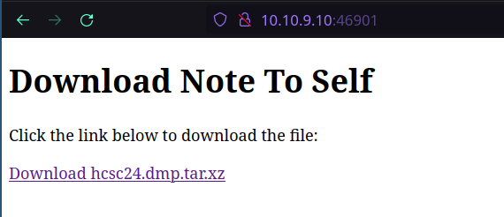

# Writeup

We can find a download site at 46901/tcp



After downloading and extracting the file, we get a ~2.13 GB memory dump.
Let's analyze it using volatility2.

I recommend using https://hub.docker.com/r/phocean/volatility to avoid a potentially painful installation process. You can also use volatility3.

## Memory forensics
Let's grab the profile using the following command: `vol.py -f hcsc24.dmp imageinfo`

The matching profile according to the output is `Win10x64_19041`

Let's dump a pstree (process list in tree view)

`vol.py -f hcsc24.dmp --profile=Win10x64_19041 pstree`

We get the following output:
```
Volatility Foundation Volatility Framework 2.6.1
Name                                                  Pid   PPid   Thds   Hnds Time
-------------------------------------------------- ------ ------ ------ ------ ----
 0xffffde012b875040:System                              4      0    114      0 2024-03-27 06:56:25 UTC+0000
. 0xffffde012e452040:smss.exe                         336      4      2      0 2024-03-27 06:56:25 UTC+0000
. 0xffffde013115c040:MemCompression                  1936      4     42      0 2024-03-27 06:56:38 UTC+0000
. 0xffffde012b946040:Registry                          72      4      4      0 2024-03-27 06:56:24 UTC+0000
 0xffffde012ece8080:wininit.exe                       500    416      1      0 2024-03-27 06:56:26 UTC+0000
. 0xffffde012ed5b080:lsass.exe                        632    500      9      0 2024-03-27 06:56:26 UTC+0000
. 0xffffde012ef18140:fontdrvhost.ex                   720    500      5      0 2024-03-27 06:56:26 UTC+0000
. 0xffffde012eb8f080:services.exe                     624    500      5      0 2024-03-27 06:56:26 UTC+0000
.. 0xffffde0130cf0280:svchost.exe                       8    624     16      0 2024-03-27 06:56:31 UTC+0000
... 0xffffde01327df080:ctfmon.exe                    2716      8     11      0 2024-03-26 23:00:33 UTC+0000
.. 0xffffde013135b200:spoolsv.exe                    1560    624      8      0 2024-03-27 06:56:39 UTC+0000
.. 0xffffde0130d3d2c0:svchost.exe                    1060    624     12      0 2024-03-27 06:56:31 UTC+0000
... 0xffffde0133ce0080:audiodg.exe                   4084   1060      6      0 2024-03-26 23:02:09 UTC+0000
.. 0xffffde0131593240:svchost.exe                    2116    624      4      0 2024-03-27 06:56:41 UTC+0000
.. 0xffffde0132e44280:svchost.exe                    3656    624     10      0 2024-03-26 22:59:21 UTC+0000
.. 0xffffde01316e9300:svchost.exe                    6224    624      5      0 2024-03-26 23:03:08 UTC+0000
.. 0xffffde012b897280:svchost.exe                    1116    624     19      0 2024-03-27 06:56:31 UTC+0000
.. 0xffffde01315c0080:svchost.exe                    2152    624     11      0 2024-03-27 06:56:41 UTC+0000
.. 0xffffde013135e080:svchost.exe                    1648    624     16      0 2024-03-27 06:56:39 UTC+0000
.. 0xffffde0133e4e080:SecurityHealth                 6280    624     13      0 2024-03-26 23:02:12 UTC+0000
.. 0xffffde0132154080:MicrosoftEdgeU                 3724    624     10      0 2024-03-26 23:03:08 UTC+0000
... 0xffffde013068a080:MicrosoftEdge_                4104   3724      2      0 2024-03-26 23:04:13 UTC+0000
.... 0xffffde0133045080:setup.exe                    6468   4104      3      0 2024-03-26 23:04:14 UTC+0000
..... 0xffffde0133c1e080:setup.exe                   6452   6468      7      0 2024-03-26 23:04:14 UTC+0000
.. 0xffffde0130d982c0:svchost.exe                    1192    624     19      0 2024-03-27 06:56:32 UTC+0000
.. 0xffffde01326e4280:svchost.exe                    4780    624      5      0 2024-03-26 23:00:45 UTC+0000
.. 0xffffde01315e0280:MsMpEng.exe                    2248    624     29      0 2024-03-27 06:56:41 UTC+0000
.. 0xffffde0130d45240:svchost.exe                    1148    624     32      0 2024-03-27 06:56:32 UTC+0000
.. 0xffffde012ef35240:svchost.exe                     748    624     19      0 2024-03-27 06:56:26 UTC+0000
... 0xffffde01316b4080:SettingSyncHos                3092    748      2      0 2024-03-26 23:02:00 UTC+0000
... 0xffffde0132d40080:StartMenuExper                3588    748      9      0 2024-03-26 23:00:56 UTC+0000
... 0xffffde013288e080:WmiPrvSE.exe                  5128    748      7      0 2024-03-26 23:03:11 UTC+0000
... 0xffffde01330ae280:RuntimeBroker.                 436    748     14      0 2024-03-26 23:00:59 UTC+0000
... 0xffffde0131c4e1c0:dllhost.exe                   4160    748      8      0 2024-03-26 23:00:38 UTC+0000
... 0xffffde0131bd4080:Microsoft.Phot                2644    748     16      0 2024-03-26 23:02:03 UTC+0000
... 0xffffde0132ee0280:RuntimeBroker.                 644    748      3      0 2024-03-26 23:00:56 UTC+0000
... 0xffffde0131a64080:WmiPrvSE.exe                  4772    748      4      0 2024-03-26 22:57:08 UTC+0000
... 0xffffde0133f152c0:dllhost.exe                   7120    748     11      0 2024-03-26 23:02:20 UTC+0000
... 0xffffde01327dd080:RuntimeBroker.                 804    748      4      0 2024-03-26 23:01:13 UTC+0000
... 0xffffde01327ed080:smartscreen.ex                1836    748      8      0 2024-03-26 23:00:37 UTC+0000
... 0xffffde0133c66080:ShellExperienc                1416    748     16      0 2024-03-26 23:02:09 UTC+0000
... 0xffffde01320982c0:CloudExperienc                3904    748      7      0 2024-03-26 22:57:03 UTC+0000
... 0xffffde0132195080:WinStore.App.e                6020    748     13      0 2024-03-26 23:02:55 UTC+0000
... 0xffffde01328e8080:SearchApp.exe                 3476    748     38      0 2024-03-26 23:00:59 UTC+0000
... 0xffffde01328ec080:ApplicationFra                6044    748      7      0 2024-03-26 23:02:55 UTC+0000
... 0xffffde0133f16080:RuntimeBroker.                7068    748      5      0 2024-03-26 23:02:32 UTC+0000
... 0xffffde013268d080:RuntimeBroker.                7092    748      7      0 2024-03-26 23:02:32 UTC+0000
... 0xffffde01326f7080:SearchApp.exe                 4044    748     27      0 2024-03-26 23:02:01 UTC+0000
... 0xffffde01330430c0:TextInputHost.                6052    748     12      0 2024-03-26 23:02:21 UTC+0000
... 0xffffde0133cdf080:RuntimeBroker.                6136    748      6      0 2024-03-26 23:02:09 UTC+0000
.. 0xffffde0130dae2c0:svchost.exe                    1264    624     15      0 2024-03-27 06:56:32 UTC+0000
.. 0xffffde01363f7080:svchost.exe                    6400    624     12      0 2024-03-26 23:03:11 UTC+0000
.. 0xffffde0131628080:NisSrv.exe                     2944    624      6      0 2024-03-26 22:56:53 UTC+0000
.. 0xffffde0132809080:svchost.exe                     772    624      7      0 2024-03-26 23:00:33 UTC+0000
.. 0xffffde012eb5e240:SearchIndexer.                 2380    624     18      0 2024-03-27 06:56:42 UTC+0000
... 0xffffde0131a81080:SearchFilterHo                3016   2380      1      0 2024-03-26 22:56:53 UTC+0000
... 0xffffde01312bc340:SearchProtocol                2828   2380      3      0 2024-03-26 22:56:52 UTC+0000
.. 0xffffde0130c7c2c0:svchost.exe                    1000    624     12      0 2024-03-27 06:56:27 UTC+0000
.. 0xffffde0132e5b080:SgrmBroker.exe                 1892    624      8      0 2024-03-26 22:59:15 UTC+0000
.. 0xffffde0132570080:svchost.exe                    3560    624      8      0 2024-03-26 22:58:26 UTC+0000
.. 0xffffde0130cbc2c0:svchost.exe                     380    624     22      0 2024-03-27 06:56:27 UTC+0000
.. 0xffffde012efbe080:sppsvc.exe                      896    624      0 ------ 2024-03-27 06:56:27 UTC+0000
.. 0xffffde012efa62c0:svchost.exe                     832    624     21      0 2024-03-27 06:56:27 UTC+0000
.. 0xffffde013259b300:svchost.exe                    1432    624      4      0 2024-03-26 22:59:07 UTC+0000
.. 0xffffde0130c36240:svchost.exe                     964    624     73      0 2024-03-27 06:56:27 UTC+0000
... 0xffffde01318e4200:taskhostw.exe                 2696    964      6      0 2024-03-26 22:56:50 UTC+0000
... 0xffffde0132ff9080:MicrosoftEdgeU                5756    964      5      0 2024-03-26 23:03:08 UTC+0000
... 0xffffde013219c300:taskhostw.exe                 4360    964      5      0 2024-03-26 23:02:01 UTC+0000
... 0xffffde0131f61080:sihost.exe                     392    964     12      0 2024-03-26 23:00:33 UTC+0000
.. 0xffffde01311cf2c0:svchost.exe                    1992    624      6      0 2024-03-27 06:56:38 UTC+0000
.. 0xffffde01311c6080:svchost.exe                    2000    624      4      0 2024-03-27 06:56:38 UTC+0000
.. 0xffffde01318e3080:svchost.exe                    4692    624      2      0 2024-03-26 22:57:49 UTC+0000
.. 0xffffde0132561240:svchost.exe                    3972    624      4      0 2024-03-26 22:58:28 UTC+0000
 0xffffde012bff1080:csrss.exe                         428    416      9      0 2024-03-27 06:56:26 UTC+0000
 0xffffde0131d18080:csrss.exe                        1036   1032     13      0 2024-03-26 23:00:32 UTC+0000
 0xffffde0130c83340:winlogon.exe                     4068   1032      5      0 2024-03-26 23:00:32 UTC+0000
. 0xffffde0131a65080:dwm.exe                         4276   4068     17      0 2024-03-26 23:00:32 UTC+0000
. 0xffffde0131f63080:fontdrvhost.ex                  4976   4068      5      0 2024-03-26 23:00:32 UTC+0000
. 0xffffde0131f5b340:userinit.exe                    4348   4068      0 ------ 2024-03-26 23:00:34 UTC+0000
.. 0xffffde0131aad300:explorer.exe                   4456   4348     64      0 2024-03-26 23:00:34 UTC+0000
... 0xffffde01318e5080:SecurityHealth                6256   4456      7      0 2024-03-26 23:02:12 UTC+0000
... 0xffffde01318e7080:notepad.exe                   3800   4456      4      0 2024-03-26 23:02:24 UTC+0000
 0xffffde0131d99300:msedge.exe                       2812   4644     51      0 2024-03-26 23:02:02 UTC+0000
. 0xffffde0132ed1080:msedge.exe                      5312   2812     14      0 2024-03-26 23:02:05 UTC+0000
. 0xffffde0131ba8080:msedge.exe                      5072   2812      9      0 2024-03-26 23:02:05 UTC+0000
. 0xffffde012ed13080:msedge.exe                      4960   2812      8      0 2024-03-26 23:02:04 UTC+0000
. 0xffffde0131cf4080:msedge.exe                       956   2812     16      0 2024-03-26 23:02:05 UTC+0000
. 0xffffde01320e9080:msedge.exe                      3048   2812     16      0 2024-03-26 23:02:05 UTC+0000
 0xffffde012b866080:msoobe.exe                        420    992      0 ------ 2024-03-27 06:56:31 UTC+0000
 0xffffde013637c080:OneDrive.exe                     3572   6392     29      0 2024-03-26 23:03:07 UTC+0000
```

Most of the processes are pretty usual, but the challenge name was related to "note", so notepad.exe is instantly interesting for us.
Maybe the user has written something in the notepad and we have to get the flag from the file that is being edited.

Let's dump the memory of notepad.exe process.

`vol.py -f hcsc24.dmp --profile=Win10x64_19041 memdump -p 3800 -D .`

According to [this source](https://andreafortuna.org/2018/03/02/volatility-tips-extract-text-typed-in-a-notepad-window-from-a-windows-memory-dump/), we can dump the strings from the extracted process using strings with a special flag.

`strings -e l 3800.dmp`

We need to use `-e l` to specify that we want to use a 16-bit little-endian encoding.

Grepping for the flag format results in recovering the flag:
```
strings -e l 3800.dmp | grep HCSC24

HCSC24{975055B22AA57458DD04B6580DC352B8}
```

## Uninteded solution

You might have already realized that we don't even have to dump the process memory because it is already contained in the memory dump.
Just run `strings -e l hcsc24.dmp | grep HCSC24` and you will be able to get the flag as well.

This challenge was a pretty good introduction in the fascinating world of memory forensics.