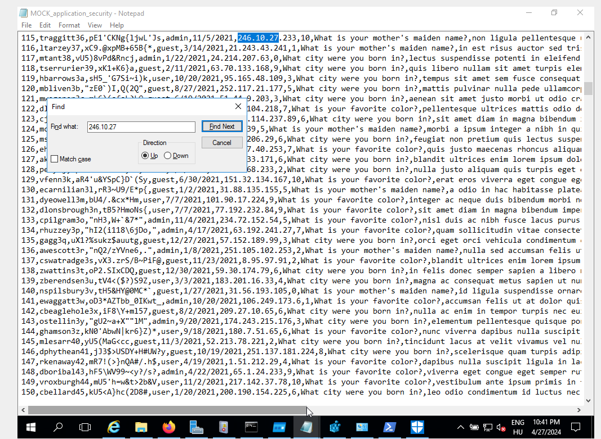
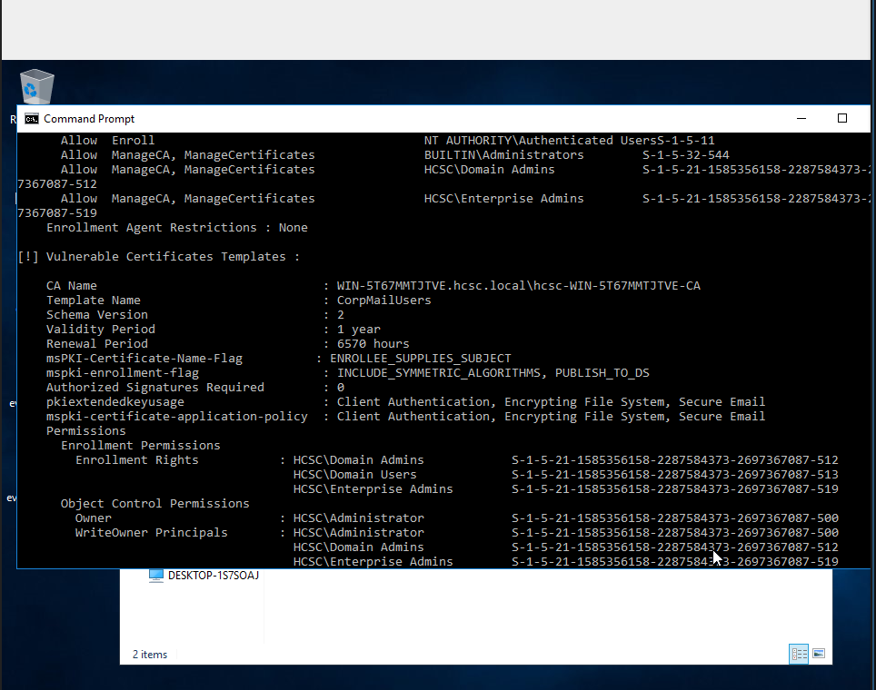
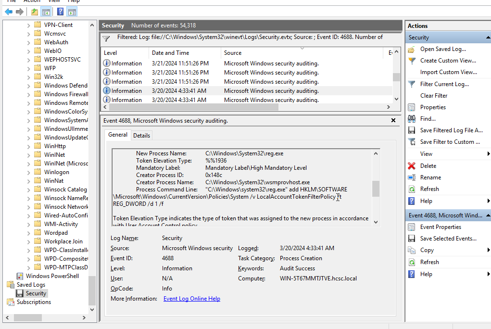
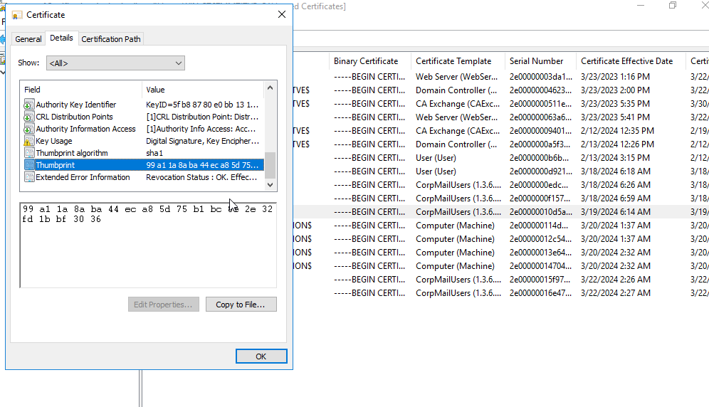
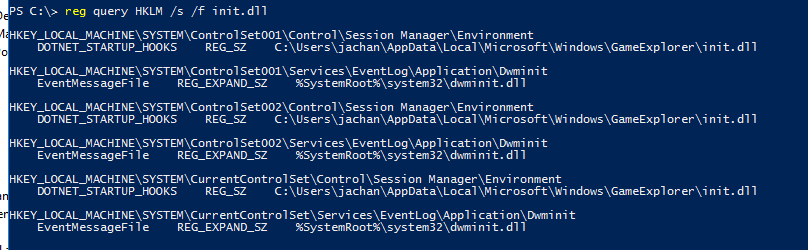
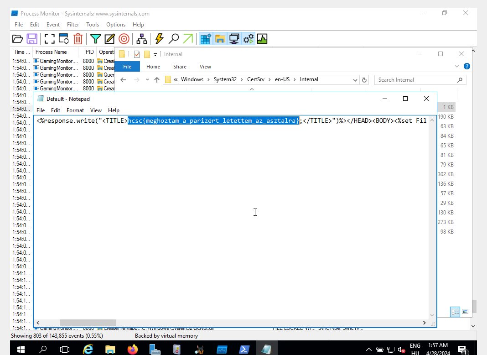
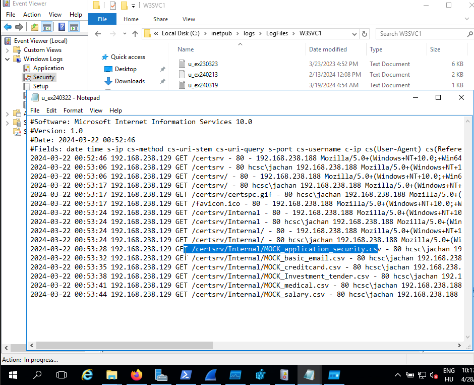
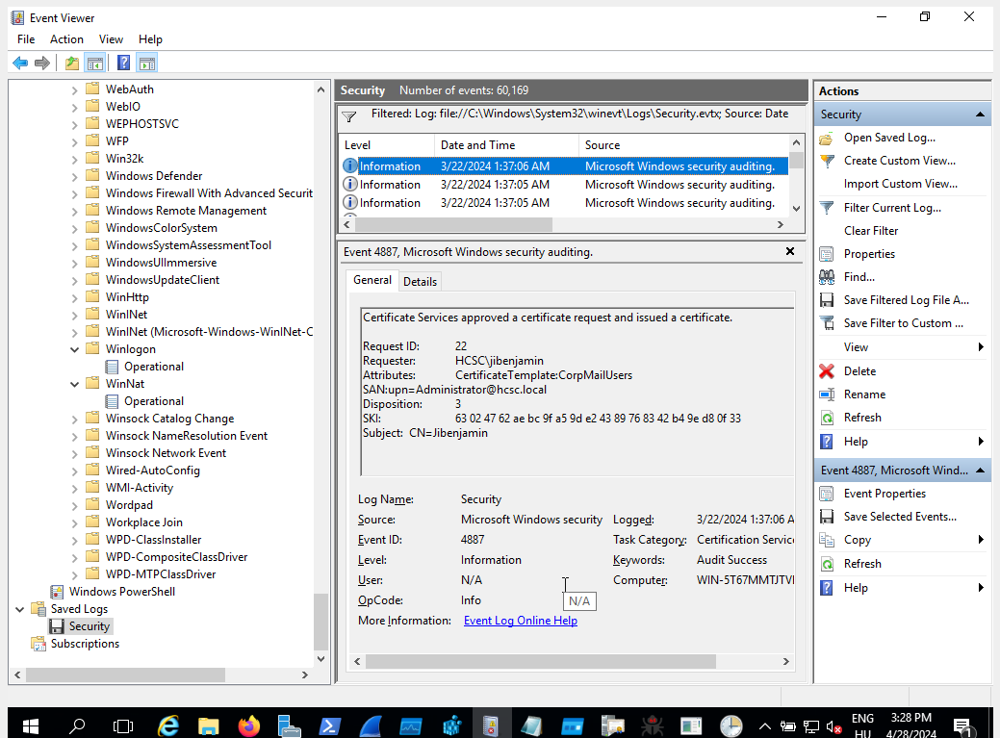
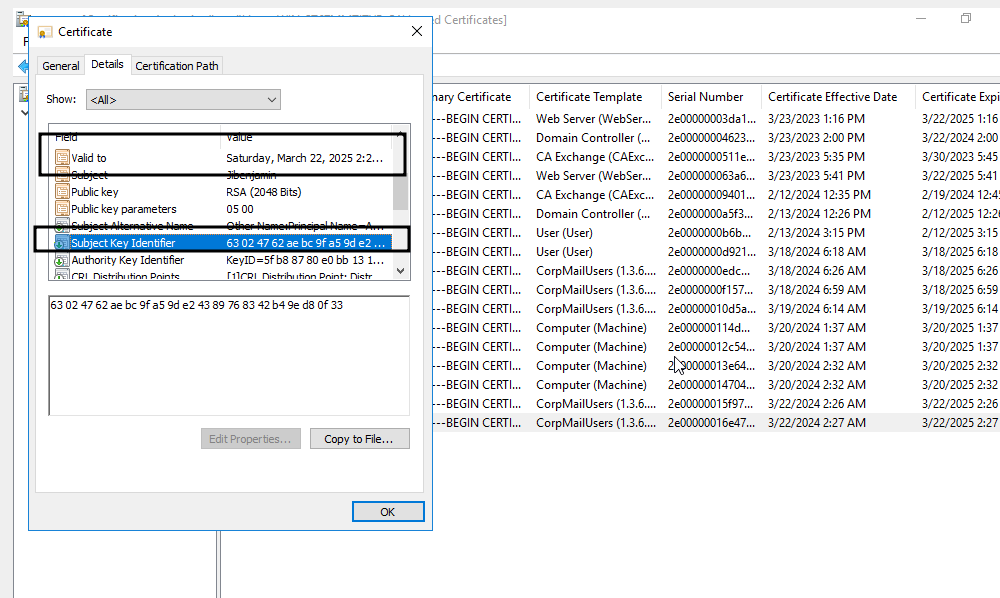

# Setup

After unzipping the downloaded `hcsc2024_defense_VM.zip` file we get files that can be imported to VirtualBox after a few modifications. The machine runs Windows Server 2012. It's a good idea to make a snapshot, before starting up the VM, this way you can easily go back to the original state if you mess something up.

# Forensic 1.

There is a directory called `MOK_DATA` under `C:\` which is unusual. We can see multiple csv files containing sensitive data after opening this directory. One of them is called  `MOCK_application_security.csv`. This file contains the security questions of the users. After searching for the given IP address we get the compromised user's security question.

FLAG: `hcsc{What is your mother's maiden name?}`

# Forensic 2.

We can find an archive called `evidence.7z` on the administrator's desktop (`C:\Users\Administrator\Desktop`). After unzipping the archive using the password `suspected` we get two files `exported_pwp.pfx` and `casmonitor.exe`. We've got the archive's password from the file `evidence_password.txt`.

We get the original file name `Certify.exe` from viewing the file's properties. This binary helps to abuse Active Directory certificate templates to escalate privileges.

The second part of the flag is the modified date of the exported_pwp.pfx file.

FLAG: `hcsc{Certify.exe_19/03/2024_23:37:23}`

# Forensic 3.

We run `casmonitor.exe find /vulnerable` to find vulnerable certificate templates.

FLAG: `hcsc{CorpMailUsers_msPKI-Certificate-Name-Flag_ENROLLEE_SUPPLIES_SUBJECT}`

# Forensic 4.

From Forensic 5. we know the user where the attacker moved after compromising jibenjamin. After filtering from process create events by jachan we quickly find a registry modification that is disabling UAC (User Account Control).

Some more reading about the technique: https://book.hacktricks.xyz/windows-hardening/authentication-credentials-uac-and-efs/uac-user-account-control

FLAG: `hcsc{HKLM\Software\Microsoft\Windows\CurrentVersion\Policies\System\LocalAccountTokenFilterPolicy_jachan}`

# Forensic 5.

Knowing that the first step to escalate privileges was abusing misconfigured certificate templates, it's a good idea to take a look at the issued certificates in the Certificate Authority program.

We quickly discover a certificate that was created by jibenjamin (the user who was compromised initially according to the introduction). The certificate is for a user called `jachan`. We know this from viewing the SAN (Subject Alternative Name) field in the details tab.

FLAG: `hcsc{99 a1 1a 8a ba 44 ec a8 5d 75 b1 bc 8e 2e 32 fd 1b bf 30 36}`

# Forensic 6.

- I did not manage to solve it during the competition - TODO

# Forensic 7.

After browsing for suspicious files we can find one called `GamingMonitor.exe` in the directory `C:\Users\Public\`. We can view the file's properties to determine the original file name which is MahSmallApp1.dll. Uploading this file to VirusTotal shows no suspicious activities, but this file will be still interesting for us.

FLAG: `hcsc{C:\Users\Public\GamingMonitor.exe_MahSmallApp1.dll}`

## Reversing GamingMonitor.exe

Opening the .NET bundle in dotPeek reveals that this binary simply prints out the current time every 5 seconds, this doesn't seem malicious at all. However, there are some side effects when we run this binary.

# Forensic 8.

//TODO procmon screenshots

Let's inspect the binary using [procmon](https://learn.microsoft.com/en-us/sysinternals/downloads/procmon). After running the binary a dll file gets loaded at `C:\Users\jachan\AppData\Local\Microsoft\Windows\GameExplorer\init.dll`. This is pretty suspicious. But what is the reason behind all this? We can find the answer most of the time after searching for the file name in the registry.

Oh, so there is an environment variable defined that is called `DOTNET_STARTUP_HOOKS`. Of course! This is a nice way of achieving persistence because it is enough to run any .NET app to launch the malware.

More reading: https://persistence-info.github.io/Data/dotnetstartuphooks.html

FLAG: `hcsc{HKLM\SYSTEM\CurrentControlSet\Control\Session Manager\Environment\DOTNET_STARTUP_HOOKS_C:\Users\jachan\AppData\Local\Microsoft\Windows\GameExplorer\init.dll}`

//TODO reversing writeup

# Forensic 9.

Reversing the malware shows that the dll will copy sensitive data from `C:\MOK_DATA` directory to `C:\Windows\System32\CertSrv\en-US\Internal\` which is a remotely accessible place through a web server. It will also deflate a GZIP file contained in the malware and write it to `C:\Windows\System32\CertSrv\en-US\Internal\Default.asp`. We can find the flag in this file. We can also find this file by using the results from procmon.

FLAG: `hcsc{meghoztam_a_parizert_letettem_az_asztalra}`

# Forensic 10.

We know now where the trojan copies the sensitive files. We can view the access logs of the web server in the directory `C:\inetpub\logs\LogFiles\W3SVC1`.

FLAG: `hcsc{192.168.238.188_2024-03-22-00-53_MOCK_application_security.csv}`

# Forensic 11.

at 22th  March

Of course, the attackers wouldn't be locked out after a simple password change. The reason behind this is the existence of certificates that can be also used for authentication. The last certificate that was issued by the attacker is valid until 2025 March!!! This certificate provides access to the domain administrator user.

FLAG: `hcsc{03/22/2025_Administrator}`

# Forensic 12.

- I couldn't solve this challenge during the competition. - TODO