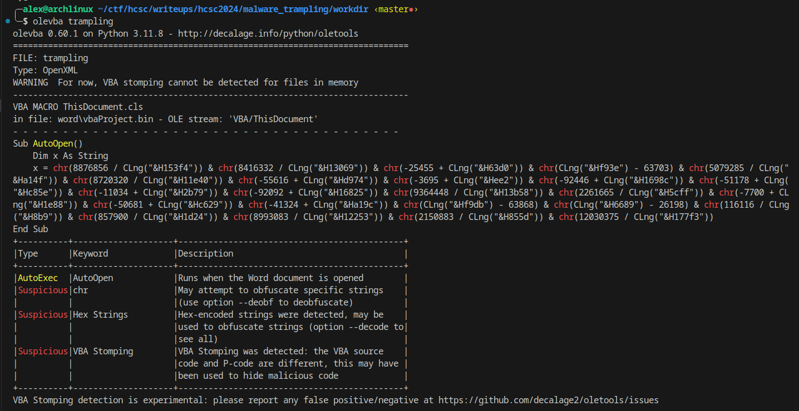

# Analyzing the malware
- We have a Microsoft OOXML file (according to file command)
- Using olevba, we can determine more information related to the macros in the office file.
 


We can see a very obfuscated code and a warning for a technique called "VBA Stomping".
Deobfuscating the currently visible code yields the following string: `flag{w4snt_it_t00_34sy?}` This is clearly a decoy flag.

## VBA Stomping
- VBA Stomping is an advanced technique to hide code in documents.
- The main idea is that in certain versions of Microsoft Office software we can display a different code in the macro browser that will run later (p-code). This might mislead a lot of people, who might think that they are running a safe macro.
- Sources, more details:
- https://medium.com/walmartglobaltech/vba-stomping-advanced-maldoc-techniques-612c484ab278
- https://medium.com/@pjbmalware/avemariarat-vba-stomping-ed6fe3d101e7

## Analyzing VBA stomped documents
- Tools:
  - https://github.com/bontchev/pcodedmp
  - https://github.com/Big5-sec/pcode2code
- First, we dump the p-code from the document using the following command `pcodedmp -d trampling > trampling.pcode`
- Second, we decompile the p-code to vba `pcode2code -p trampling.pcode -o decompiled.vba`
- After these steps, we get a heavily obfuscated vba code. [decompiled.vba](workdir/decompiled.vba)
- Setting up an environment for dynamic analysis seems pretty tough, we have to get an ancient version of Word to debug this file, so I went with a completely static approach.

The entry point:
```vb
Sub AutoOpen()
  Dim reheyxuwczkdfibprd As String
  reheyxuwczkdfibprd = Chr(CLng(stvxkonagjkfkrd("2648") & stvxkonagjkfkrd("356231")) - 1390) & Chr(CLng(stvxkonagjkfkrd("2648") & stvxkonagjkfkrd("38363639")) - 34298) & Chr(3338997 / CLng(stvxkonagjkfkrd("2648") & stvxkonagjkfkrd("37376139"))) & Chr(-60645 + CLng(stvxkonagjkfkrd("2648") & stvxkonagjkfkrd("65643535"))) & Chr(-64377 + CLng(stvxkonagjkfkrd("26486662") & stvxkonagjkfkrd("6461"))) & Chr(CLng(stvxkonagjkfkrd("2648") & stvxkonagjkfkrd("37346539")) - 29819) & Chr(-61427 + CLng(stvxkonagjkfkrd("26486630") & stvxkonagjkfkrd("3663")))
  Dim pdntatjcheryquiar As String
  pdntatjcheryquiar = ADP(reheyxuwczkdfibprd)
  Dim edzbgjugomlsj As String
  edzbgjugomlsj = butsqagaopvcnoodtck(AD, pdntatjcheryquiar)
End Sub
```

The function `stvxkonagjkfkrd` takes a hex-encoded string and decodes it into a string. `CLng` returns the number representation of a string. `Chr` returns a char based on the input number (using ASCII encoding). ADP calls `ActiveDocument.BuiltInDocumentProperties` and returns the result. `AD` is the ActiveDocument

Based on this information, we can decode the obfuscated strings and rename the variables.
```vb
Sub AutoOpen()
  Dim company_Str As String
  company_Str = "Company"
  Dim company_property_val As String
  company_property_val = ADP(company_Str)
  Dim edzbgjugomlsj As String
  edzbgjugomlsj = butsqagaopvcnoodtck(AD, company_property_val)
End Sub
```

Now let's analyze `butsqagaopvcnoodtck`

```vb
Function butsqagaopvcnoodtck(d As )
  Dim idklxrap As String
  Dim tudjxdzot As Integer
  Dim nyquvvyrkpzfugrtfm As Integer
  nyquvvyrkpzfugrtfm = Len(vwkwcizm)
  Dim vbfjerof As String
  Dim lfrwvvp As String
  Dim saaadoyb As String
  Dim dsvwnqv As String
  Dim wtvpzqnfaghargqw As Integer
  Dim twvkuxkbx As Integer
  Dim ogygbitmb As Integer
  Dim eichgukxdf As String
  Dim i, j, ytqsckoletsicsxcc As Integer
  lfrwvvp = Chr(CLng(azrppchfhrleghj("2648") & azrppchfhrleghj("616" & "63131")) - 44750) & Chr(791097 / CLng(azrppchfhrleghj("2648") & azrppchfhrleghj("316" & "26437"))) & Chr(-11375 + CLng(azrppchfhrleghj("2648" & "32") & azrppchfhrleghj("636" & "463"))) & Chr(CLng(azrppchfhrleghj("264865" & "39") & azrppchfhrleghj("6232")) - 59717) & Chr(-22715 + CLng(azrppchfhrleghj("26" & "4835") & azrppchfhrleghj("393" & "230"))) & Chr(-628 + CLng(azrppchfhrleghj("2648") & azrppchfhrleghj("3265" & "32"))) & Chr(-76888 + CLng(azrppchfhrleghj("2648") & azrppchfhrleghj("31326" & "36363"))) & Chr(CLng(azrppchfhrleghj("2648") & azrppchfhrleghj("3465" & "6562")) - 20088)
  idklxrap = d.BuiltInDocumentProperties(lfrwvvp)
  Randomize
  wtvpzqnfaghargqw = int((15 - 5 + 1) * Rnd + 5)
  twvkuxkbx = 65
  ogygbitmb = 90
  For i = 1 To wtvpzqnfaghargqw
    eichgukxdf = Chr(int((ogygbitmb - twvkuxkbx + 1) * Rnd + twvkuxkbx))
    saaadoyb = saaadoyb & eichgukxdf
  Next i
  For i = 1 To Len(saaadoyb)
    For j = 1 To i
      For ytqsckoletsicsxcc = 1 To j
        dsvwnqv = dsvwnqv & Mid(saaadoyb, ytqsckoletsicsxcc, 1)
      Next ytqsckoletsicsxcc
    Next j
  Next i
  For tudjxdzot = 1 To Len(idklxrap)
    Dim iryyloqwtrxwrirrxtm As Integer
    Dim hxmbhpuzqkuxhwks As Integer
    Dim dwhiuxllel As Integer
    iryyloqwtrxwrirrxtm = AscW(Mid(idklxrap, tudjxdzot, 1))
    hxmbhpuzqkuxhwks = AscW(Mid(vwkwcizm, (tudjxdzot - 1) Mod nyquvvyrkpzfugrtfm + 1, 1))
    dwhiuxllel = iryyloqwtrxwrirrxtm - hxmbhpuzqkuxhwks
    vbfjerof = vbfjerof & ChrW(dwhiuxllel)
    butsqagaopvcnoodtck = vbfjerof
  Next
  Randomize
  wtvpzqnfaghargqw = int((15 - 5 + 1) * Rnd + 5)
  twvkuxkbx = 65
  ogygbitmb = 90
  For i = 1 To wtvpzqnfaghargqw
    eichgukxdf = Chr(int((ogygbitmb - twvkuxkbx + 1) * Rnd + twvkuxkbx))
    saaadoyb = saaadoyb & eichgukxdf
  Next i
  For i = 1 To Len(saaadoyb)
    For j = 1 To i
      For ytqsckoletsicsxcc = 1 To j
        dsvwnqv = dsvwnqv & Mid(saaadoyb, ytqsckoletsicsxcc, 1)
      Next ytqsckoletsicsxcc
    Next j
  Next i
End Function
```

`azrppchfhrleghj` is the same as `stvxkonagjkfkrd`, it decodes a hex-encoded string, we already know, how to deobfuscate strings. We can also remove some unused codes.

```vb
Function butsqagaopvcnoodtck(d As )
  Dim comments_property_Val As String
  Dim tudjxdzot As Integer
  Dim nyquvvyrkpzfugrtfm As Integer
  nyquvvyrkpzfugrtfm = Len(vwkwcizm)
  Dim vbfjerof As String
  Dim comments_Str As String

  comments_Str = "Comments"
  comments_property_Val = d.BuiltInDocumentProperties(comments_Str)
  
  For tudjxdzot = 1 To Len(comments_property_Val)
    Dim iryyloqwtrxwrirrxtm As Integer
    Dim hxmbhpuzqkuxhwks As Integer
    Dim dwhiuxllel As Integer
    iryyloqwtrxwrirrxtm = AscW(Mid(comments_property_Val, tudjxdzot, 1))
    hxmbhpuzqkuxhwks = AscW(Mid(vwkwcizm, (tudjxdzot - 1) Mod nyquvvyrkpzfugrtfm + 1, 1))
    dwhiuxllel = iryyloqwtrxwrirrxtm - hxmbhpuzqkuxhwks
    vbfjerof = vbfjerof & ChrW(dwhiuxllel)
  Next
End Function
```

The following code can be easily translated to python
```python
def butsqagaopvcnoodtck(d):
    comments_property_Val = ""
    tudjxdzot = 0
    nyquvvyrkpzfugrtfm = len(vwkwcizm)
    vbfjerof = ""
    comments_Str = "Comments"

    comments_property_Val = d.BuiltInDocumentProperties(comments_Str)

    for tudjxdzot in range(len(comments_property_Val)):
        iryyloqwtrxwrirrxtm = ord(comments_property_Val[tudjxdzot])
        hxmbhpuzqkuxhwks = ord(vwkwcizm[(tudjxdzot - 1) % nyquvvyrkpzfugrtfm])
        dwhiuxllel = iryyloqwtrxwrirrxtm - hxmbhpuzqkuxhwks
        vbfjerof += chr(dwhiuxllel)

    return vbfjerof
```

This is basically an encryption that subtracts a repeating key from the ciphertext that comes from the "Comments" property. But what is the repeating key? We can easily determine this using the fact that our plaintext must start with HCSC

First, let's get the value of the "Comments" property. We can use a website like this to do this task: https://products.aspose.com/total/net/metadata/word/ (or just dig up from the xml files after unzipping the word document)

Hex-encoded comments property: 95acb6b5ead8a3e0cdacbfa5a6cee6e396e1bdb2d1d9ce9490c5a5869b9ba6a5a7a498a5ca

## Finding the key
```python
ct = bytes.fromhex("95acb6b5ead8a3e0cdacbfa5a6cee6e396e1bdb2d1d9ce9490c5a5869b9ba6a5a7a498a5ca")
pt = b"HCSC"
key = ""

for i in range(len(ct)):
    key += chr(ct[i] - pt[i % len(pt)])

print(key) # Micr
```

The key starts with `Micr` - wait, the key is actually `Microsoft` which is the value of the `Company` property of the document.

Let's decode the ciphertext.

```python
ct = bytes.fromhex("95acb6b5ead8a3e0cdacbfa5a6cee6e396e1bdb2d1d9ce9490c5a5869b9ba6a5a7a498a5ca")
key = b"Microsoft"
pt = ""

for i in range(len(ct)):
    pt += chr(ct[i] - key[i % len(key)])

print(pt)
```

This code prints out the flag `HCSC{e4zY_VB4_st0mpIng_!!_1928464521}`

In my opinion, this challenge was pretty interesting, it is wild that in some versions of Word browsing macros in the document might be misleading.