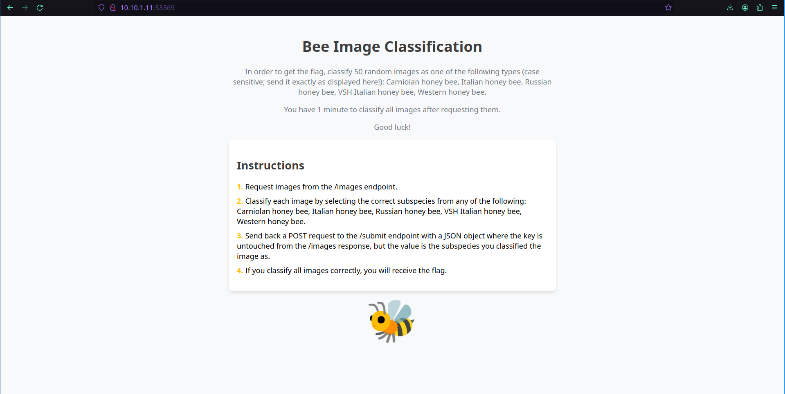

# Writeup

There is a web service running on port `53369/tcp`
We can get some additional information here about the challenge.



An example output for the endpoint `/images` can be found [here](workdir/images.json).

My first idea was to look around on GitHub for trained above 99% accuracy models for this exact problem because probably many smart researchers have already done this project.

I've found this very promising project: https://github.com/jochen-eds/bee-app/
This classifier shows pretty good results.
```
The CNN (more info about its architecture and hyperparameters can 
be found on [my homepage](https://zubrod-eds.de/en/2021/04/11/bienen-klassifizieren-mit-cnns/)) had an accuracy higher than
99%, meaning that from the more than 850 bee pictures that were set aside for testing 
the CNN only 8 were classified wrong.
```

We follow the installation steps and modify the [bee_app.py](workdir/bee_app.py) file for our purposes.
After running the classifier script, we get the flag.

```
Congratulations! Here is the flag: HCSC24{d1d_y0u_f1nd_th3_d4t4s3t_4nd_h4shed_or_d1d_u_use_ml?}
```

## A different, hacky way to solve this challenge

The flag mentions finding the dataset. If we find a labelled dataset, we could match the hashes of the images and return the result based on that.
Great competitors like [tk](https://tkh4ck.github.io/ctf/2024/hcsc/misc/2be2bee/) went down on this path. I think this solution is very creative and catches the out-of-the-box thinking aspect of the hacker mindset.