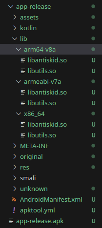
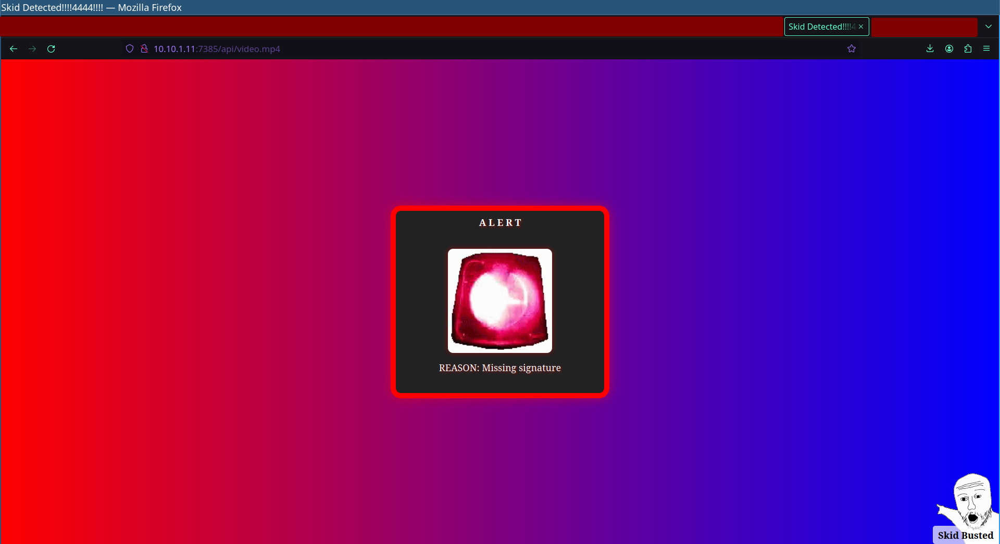
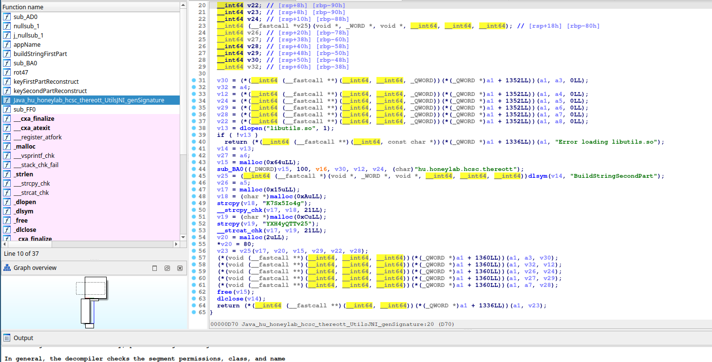
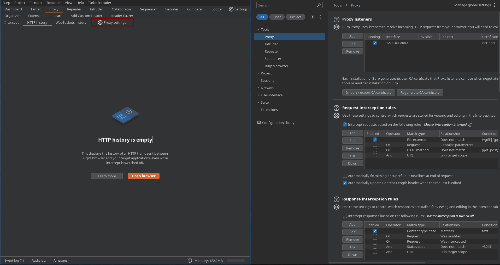
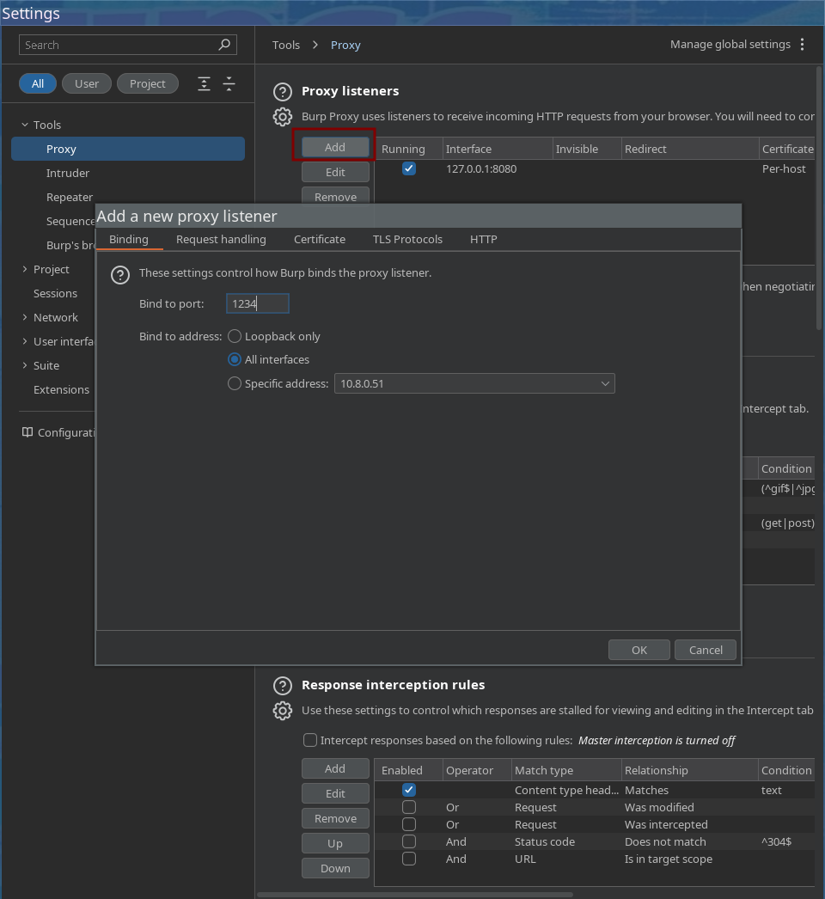
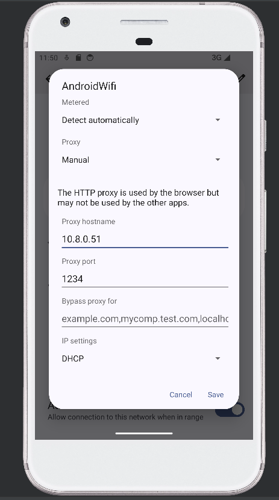
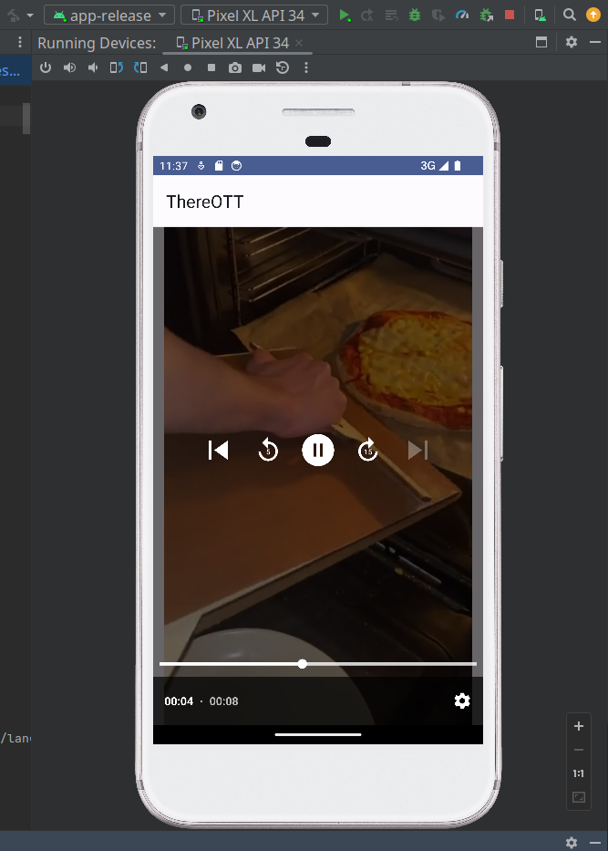
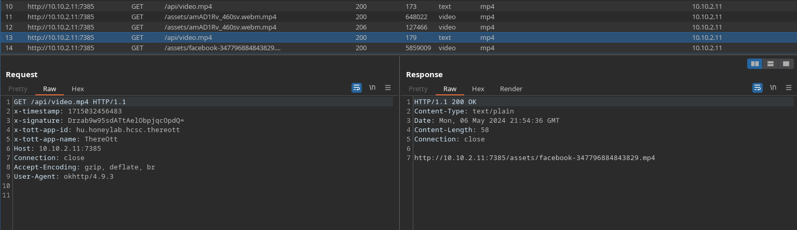

# Reversing the app

I started to solve this challenge using a static approach to reverse engineer the app.

Let's use [apktool](https://apktool.org/) to take a high-level look at the app.

`apktool d app-release.apk`

We might also use [dex2jar](https://github.com/pxb1988/dex2jar) and [recaf](https://github.com/Col-E/Recaf) for the Java decompilation if we don't like to read smali code. In this specific challenge these are pretty unnecessary, but in other Android reversing projects they can be useful in my opinion.



In the lib directory, we can find two interesting dynamically loaded libraries. We will analyze them later, for now, let's figure out the entry point of the app.

There is a definition for MainActivity in the file [AndroidManifest.xml](workdir/app-release/AndroidManifest.xml)
```xml
<activity android:exported="true" android:label="@string/app_name" android:name="hu.honeylab.hcsc.thereott.MainActivity" android:theme="@style/Theme.ThereOTT">
    <intent-filter>
        <action android:name="android.intent.action.MAIN"/>
        <category android:name="android.intent.category.LAUNCHER"/>
    </intent-filter>
</activity>
```

`hu.honeylab.hcsc.thereott` is definitely the most interesting package. We can find two classes here. [MainActivity](workdir/app-release/smali/hu/honeylab/hcsc/thereott/MainActivity.smali) and [UtilsJNI](workdir/app-release/smali/hu/honeylab/hcsc/thereott/UtilsJNI.smali)

The MainActivity class defines an array with a few http servers like `http://10.10.1.11:7385` and `http://10.10.2.11:7385`. (These are running the same software)

It also defines an endpoint `/api/video.mp4`. When we visit the endpoint we can see the following:



This endpoint is protected with a signature. The client generates a signature that verifies that the request was sent by the application, not a bot. If we don't give a valid signature the server will block our request. We have to bypass this protection to get the flag.

Let's take a look at the UtilsJNI class now.

```smali
# direct methods
.method static constructor <clinit>()V
    .locals 1

    const-string v0, "antiskid"

    invoke-static {v0}, Ljava/lang/System;->loadLibrary(Ljava/lang/String;)V

    return-void
.end method

.method public static native genSignature(Ljava/lang/String;Ljava/lang/String;Ljava/lang/String;Ljava/lang/String;Ljava/lang/String;Ljava/lang/String;)Ljava/lang/String;
.end method
```

If we take a look at the smali bytecode, we can see that it loads the native library `antiskid` in the static init function and it defines a new static native function that takes 6 strings and returns a string.

Let's open `antiskid.so` in our favourite decompiler to see how it works.



The native function loads another dynamic library called `libutils.so` and calls the function `BuildStringSecondPart` with 6 parameters in this new binary. Before it calls that method, it runs `keyFirstPartReconstruct`, but this function is inlined in the assembly.

`libutils.so` is a go binary, at this point the static analysis starts to get pretty complicated. I like to take the path of least resistance when it comes to reverse engineering, so let's analyze this app dynamically.

## Dynamic approach

After importing the apk file to [Android Studio](https://developer.android.com/studio) and starting up a rooted emulator we can set up [Burp](https://portswigger.net/burp/documentation/desktop/tools/proxy) for proxying the http traffic and [Frida](https://frida.re/docs/android/) for hooking into functions.

Let's set up the connection between Burp and the Android emulator.

Step 1: Open proxy settings under the proxy tab in Burp.



Step 2: Click to add a new proxy listener. Bind it to an arbitrary port. Instead of binding to the loopback interface, you have to bind it to the Android emulator's interface (or all interfaces, but be careful if your device is accessible on a network and you don't use a firewall blocking that port then any people can use your computer as a proxy server).



Step 3: Set up the proxy in Android network settings.





The app is a video player that repeatedly fetches new memes from the previously mentioned endpoint.



We can catch the signed request. When we modify it to a POST request to the endpoint `/flag` we get an invalid signature error, so the signature is unfortunately checked and it's endpoint and content specific.

Fun fact: Directory listing in the `assets` directory is enabled so we can download all the fun memes.

Let's hook the native `genSignature` function using frida. The following code prints out all the parameters given to the function and returns the original result. It acts like a proxy. 

```javascript
Java.perform(function(){
    var UtilsJNI = Java.use("hu.honeylab.hcsc.thereott.UtilsJNI")

    //public static native String genSignature(String paramString1, String paramString2, String paramString3, String paramString4, String paramString5, String paramString6)
    UtilsJNI.genSignature.overload(
    'java.lang.String', 'java.lang.String', 'java.lang.String', 'java.lang.String', 'java.lang.String', 'java.lang.String'
    ).implementation = function(p0, p1, p2, p3, p4, p5) {
        console.log("[+] genSignature:")
        console.log("[-] p0: " + p0)
        console.log("[-] p1: " + p1)
        console.log("[-] p2: " + p2)
        console.log("[-] p3: " + p3)
        console.log("[-] p4: " + p4)
        console.log("[-] p5: " + p5)

        return this.genSignature(p0, p1, p2, p3, p4, p5)
    }
})
```

After installing the frida agent we can perform this hook using the command: `frida -U -l signature_hook.js -f hu.honeylab.hcsc.thereott`

The output of our hook looks like:
```
[+] genSignature
[-] p0: GET
[-] p1: /api/video.mp4
[-] p2: 
[-] p3: x-tott-app-id:hu.honeylab.hcsc.thereott,x-tott-app-name:thereott
[-] p4: 
[-] p5: 1715032891291
```

p0 is the http method, p1 is the endpoint, we don't know what is the role of p2, p3 are the headers separated by a comma and p5 is clearly a timestamp in unix epoch form to millisecond accuracy.

Let's modify our code to forge signatures using the following piece of code:

```javascript
console.log(this.genSignature("POST", "/flag", p2, p3, "flag", p5))
```

After some guessing I could determine that p4 is the body of the request. The result is a valid signature printed out to the console for the /flag endpoint.

Let's copy this signature to our python code:
```python
import requests

url = "http://10.10.1.11:7385"
r = requests.post(url + "/flag", data="flag", headers={
    "x-signature": "ffCcKEq4FTp+xzdi6UucU+hi9hA=",
    "x-timestamp": "1715033313505",
    "x-tott-app-id": "hu.honeylab.hcsc.thereott",
    "x-tott-app-name": "ThereOtt"
})

print(r.text)
```

Don't forget to modify the x-timestamp header.

After sending the request we get the flag: `HCSC24{3v3n_n@t1v3s_c4n_b3_h00k3d}`