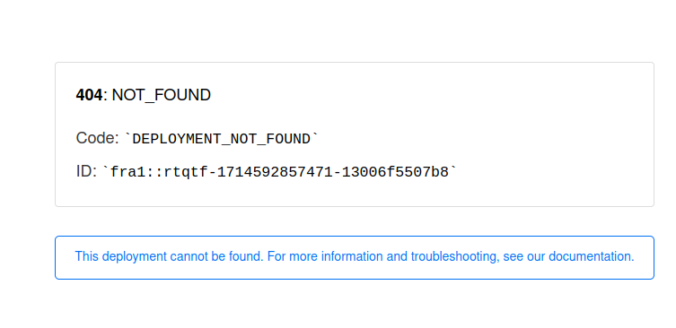
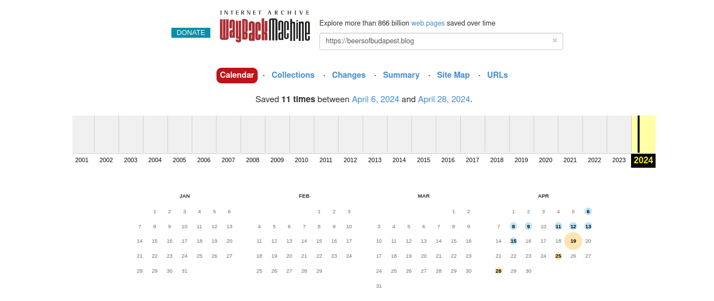
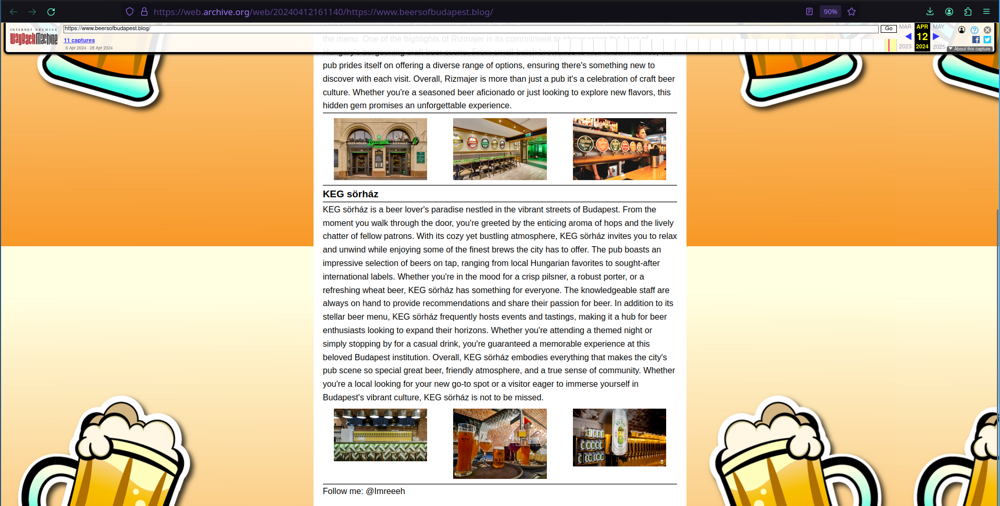
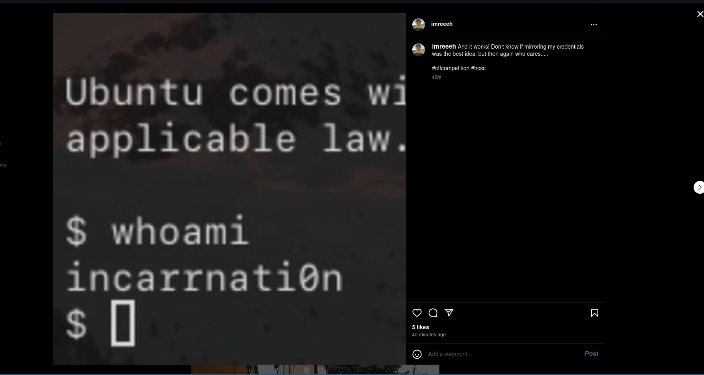
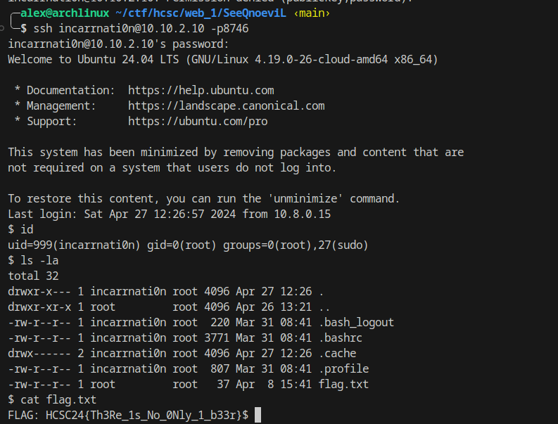

# The investigation
- As expected, the given page does not exist.
- Using WayBack machine we can see 11 different versions of the web page.
- For us, the save on April 12th is the most interesting.

At the bottom of the page, there is a reference to an Instagram account called Imreeeh. When we visit the account we can see a new post. (It's not there anymore)

We know that there is an SSH server at 10.10.2.10:8746 using our port scan results.
We can log in based on this post with the following credentials: `incarrnati0n:n0itanrracni`

There is a flag.txt in our home directory.

Flag: `HCSC24{Th3Re_1s_No_0Nly_1_b33r}`