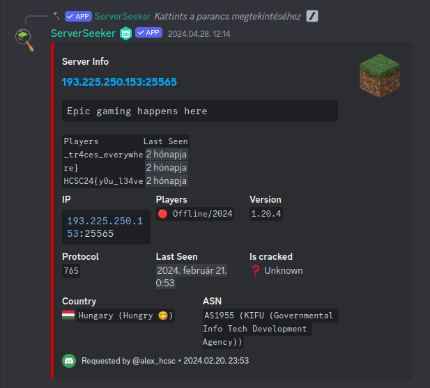

# Writeup
- My first approach was to browse YouTube videos of people creating Minecraft server tutorials and checking out comments for other clues, but this approach failed.
- I also did some recon on the ip address and checked out reverse DNS for domain names, but could not find anything. 
- Later in the competition, the following hint was released:
```
"its happened two times, it joins my server and then leaves in the next second, the two times it had happened,he joined when none of my friends had joined yet,but i saw it on the server console,i oppened my ports to my friends to be able to join, but how does he knows my ip? i try to locate its ip and it lead me to a server in germany, its probably a bot, but i want to know if anyone else have seen it."

https://youtu.be/JdfHFc85Zow
```

Ahaa, so we need a kind of wayback machine just for server banners.
When we google the paragraph seen in the hint we find a Reddit thread.

https://www.reddit.com/r/Minecraft/comments/143zufm/a_player_named_serverseeker_is_joining_my_server/

In the comments something called `ServerSeeker` is mentioned all over the place. It turns out this a service that is scanning the internet for publicly avaible Minecraft servers and gets data from them. We can access this service for free on a discord server.



Querying the given IP address results in getting the flag.

`HCSC24{y0u_l34ve_tr4ces_everywhere}`