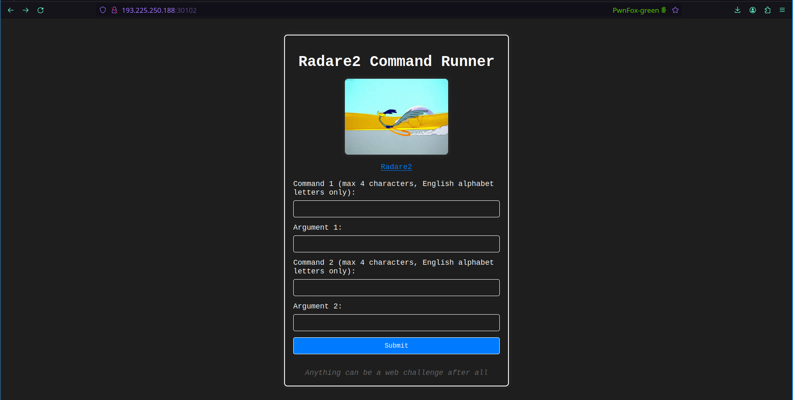
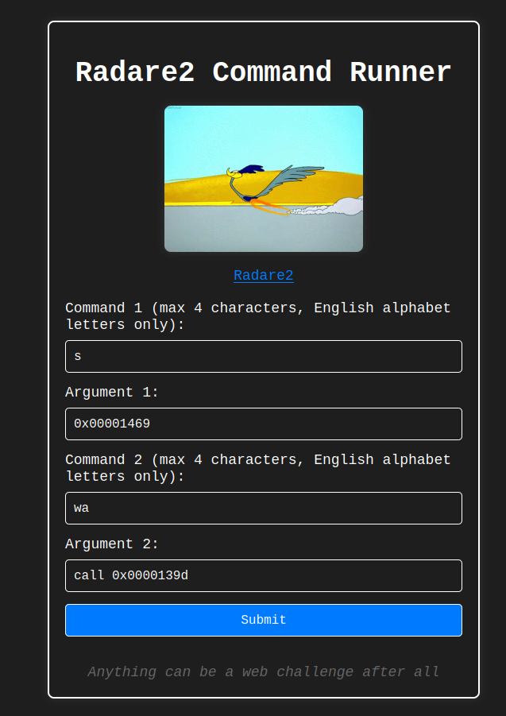

# Writeup



After starting a container and visiting the page we can see a form that accepts radare2 commands with a few restrictions.

There are some other restrictions on the server side (we know this from the given source code parts), for example, we can't use commands like `cat`
```go
func isValidCommand(command string) bool {
	if len(command) > 4 {
		return false
	}
	var blackList = []string{"cat", "ls", "lu", "ll", "lr", "le", "pwd", "cd"}
	for _, black := range blackList {
		if strings.ToLower(command) == black {
			return false
		}
	}
	match, _ := regexp.MatchString("^[a-zA-Z0-9]+$", command)
	return match
}
```

This check doesn't block `tac`, but we can't use special characters in the argument, so we have to go down on the intended radare2 path.

I started by running the command `o` without any parameters. It gave the following results:
```
 3 * rwx 0x00003710 /tmp/adams_4483
 4 - rw- 0x00000068 null://104
 5 - rw- 0x000f0000 malloc://983040
```

We have rwx access to `/tmp/adams_4483`, its size is 0x3710 bytes.
Let's look around in the binary using the command `pd 0x1000`.

I saved the output to [this file](files/binary.txt)

There are a few interesting functions:
- `fcn.0000142d` - the entry point
- `fcn.000012ec` - checks if the contents of `/etc/hostname` are equal to - `adams-pc`, this function is invoked in the entry point, if the statement is true
- `fcn.0000122b` - prints out a random quote
- `fcn.0000139d` - prints out the flag (reads out the contents of `/secret/flag.txt`)
- `fcn.00001215` - prints out unauthorized

By default, the binary always calls `fcn.00001215` and prints out the string `Unauthorized`, this call is made at the following memory address: `0x00001469`

We can patch this call to `fcn.0000139d` and the program will print out the flag instead of outputting `Unauthorized`



We seek to 0x00001469 and patch out the assembly at that memory address to `call 0x0000139d`

The server outputs the following:
```
Radare2 Output:


Final Binary Output:
HCSC24{d0ct0r_0r_nOt_U_r3c0v3r3d_7h3_fl4g}
```

I think this challenge was a great opportunity the learn the basics of radare2. This tool can be very useful for reverse engineering.