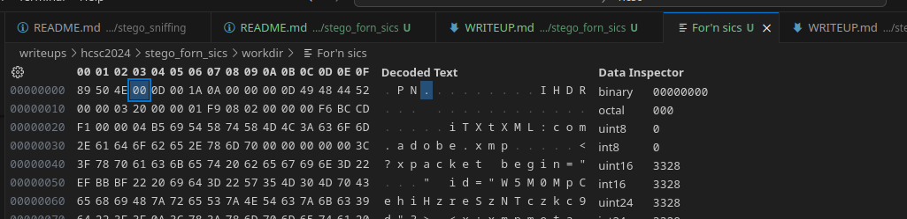
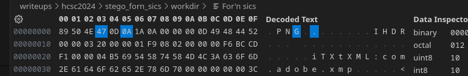

# Writeup

We get a png file with a broken header. We know this fact because the file contains strings like `IHDR`, `IDAT`, `IEND`, which are referring to PNG chunks. There is also some metadata in the file.

Let's fix the header.

According to the specification, a PNG file must start with the following bytes (hex-encoded): `89  50  4e  47  0d  0a  1a  0a`
In this case, two bytes are wrong.

After opening our picture in our favourite image viewer we can see the flag.

Flag: `HCSC24{He4dAch3}`
