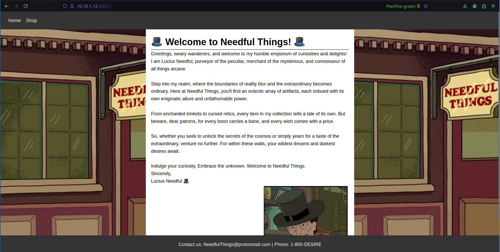
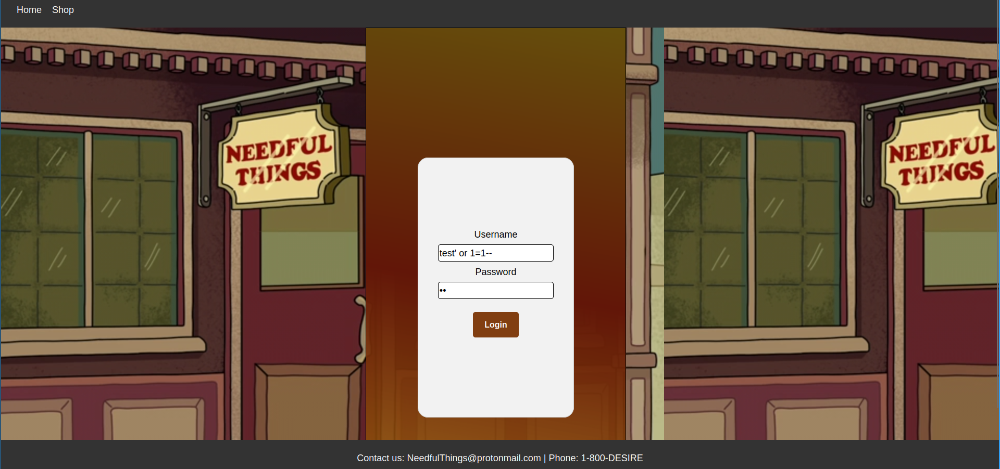
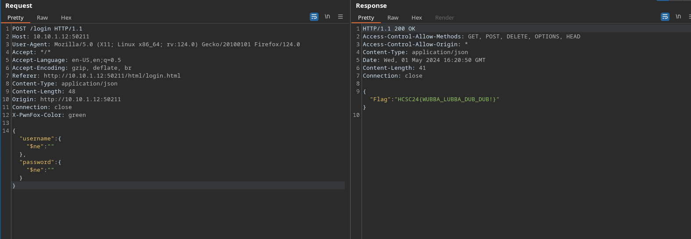
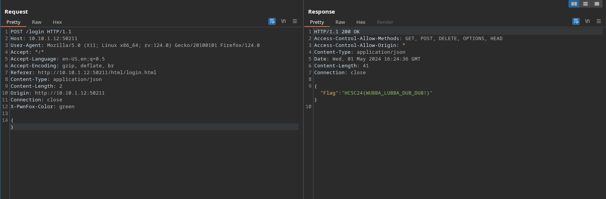

# Recon
- The challenge runs on port `50211`
- In the source we find multiple references for files in a /html/ directory.
- The directory listing is enabled, we find a file named `login.html`, which is a hidden login page.

# Exploitation

We see the login page and test for sql injection, we fail.
My next guess was nosql injection.

The exploitation succeeded, my query asked for an entry that hadn't have empty username and password.

# (probably) unintended solve

When we send an empty json object it also gives the flag because of the nosql injection.
A solution for this (probably) uninteded way might be the checking of the existence of the keys in the json object.

Flag: `HCSC24{WUBBA_LUBBA_DUB_DUB!}`