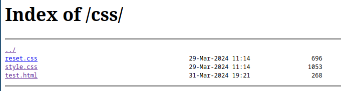

# Overview
After a port scan, we can determine that the challenge is running on the port `5966`.


We can watch random memes on the site, and when we click on the button a piece of javascript code runs.
```javascript
function newPicture() {
  let randomInt = Math.floor(Math.random() * 10) + 1;
  document.getElementById(
    "meme-div"
  ).innerHTML = ``;
}
```

innerHTML is a dangerous function because it can cause xss if it is supplied with untrusted input, but we can't really control the value of randomInt, so this is useless for us, but we might look around in the folder /images/


As you can see the directory listing is enabled, we might want to check out /css/



There is a file called test.html, which seems interesting...


The source of the test.html file contains the flag. The text color is set to white, this might trip up ctf players, who don't check the source.

This was a very easy challenge, it taught us the importance of disabling the directory listing feature and the dangers of putting sensitive files on a public server.